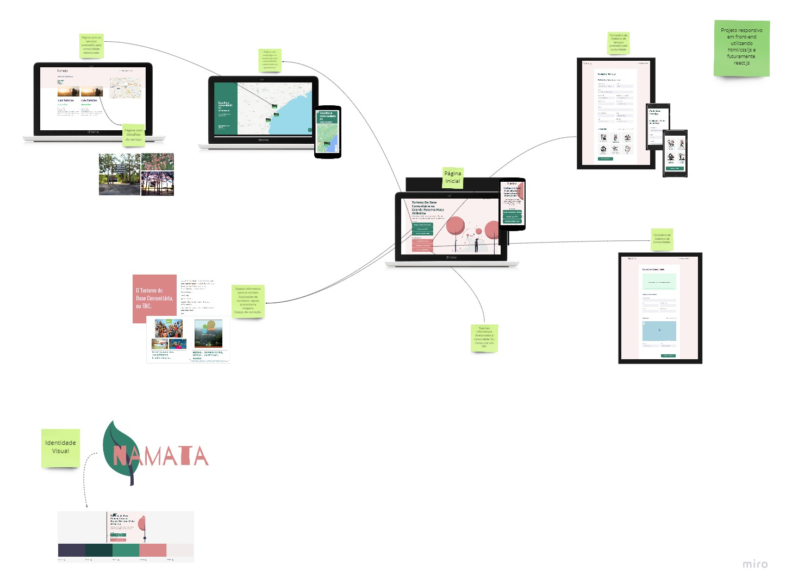

<h1 align="center">
🍃🍃🍃🍃 Projeto NAMATA - projeto front-end
</h1>
 

 >> Status do Projeto: Em desenvolvimento :warning: <<  
  Futuramente
  

# Indice

- :rocket: [Sobre o Projeto](#rocket-sobre-o-projeto)
- 👨‍💻️ [Tecnogias utilizadas](#%EF%B8%8F-tecnogias-utilizadas)

---

## 🚀 Projeto no ar
http://namata.surge.sh/

---
   

## :rocket: Sobre o Projeto

 O objetivo foi de construir uma plataforma que servisse de base e de visualização ao Projeto Namata.
Projeto Namata foi desenvolvido durante o hackhathon [Conservathon](https://conservathon.teiadesolucoes.com.br/)

O desafio que o grupo escolheu foi o de criar soluções aplicadas em UNIDADES DE CONSERVAÇÃO para fomentar o turismo e que possam inspirar novos negócios/serviços.

A plataforma tem como objetivo facilitar o empreendedorismo na região da Grande Reserva Mata Atlântica ligao ao turismo de base comunitária.

Em razão do pouco tempo, o código teve por base o projeto desenvolvido durante a Next Level Week da Rocketseat

---

## 👨‍💻️ Tecnogias utilizadas

O projeto foi desenvolvido utilizando as seguintes tecnologias:

- Java Script
- HTML/CSS

### IDE

- [Visual Studio Code](https://code.visualstudio.com/)

---

## ELABORAÇÃO DO PROJETO NO [MIRO](https://miro.com/app/board/o9J_ki_aLuM=/)
  

## Grupo:

Tatiana Fischer e Pedro Maia (responsáveis pelo código)
Clara Carolina
Beatriz Papin
Adilson Chrestani
Leonardo Cardoso
